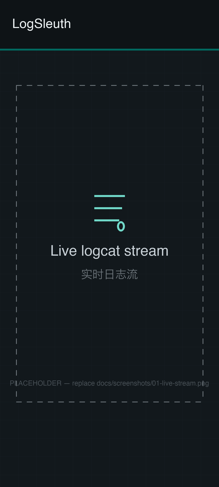
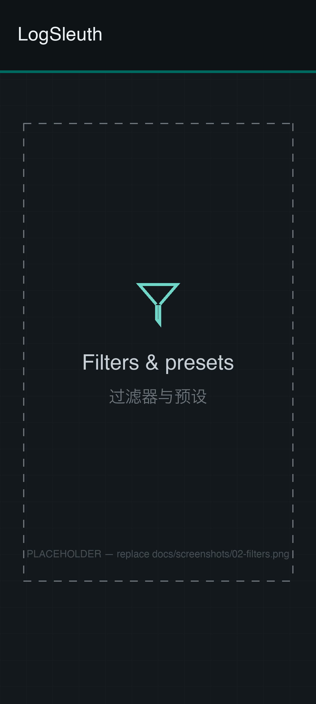
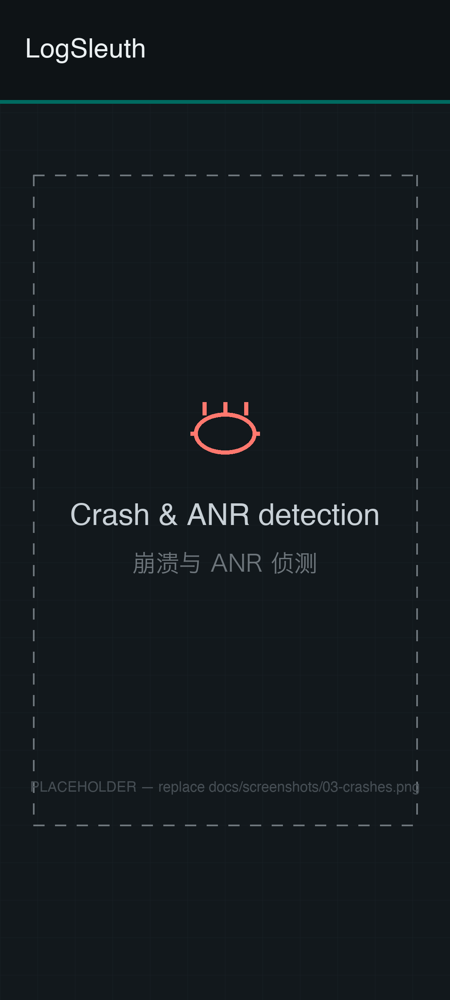
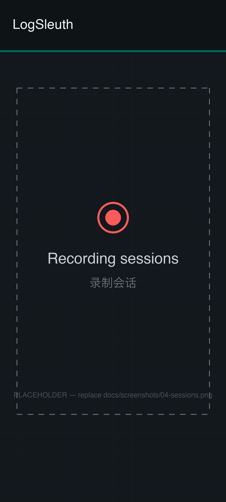
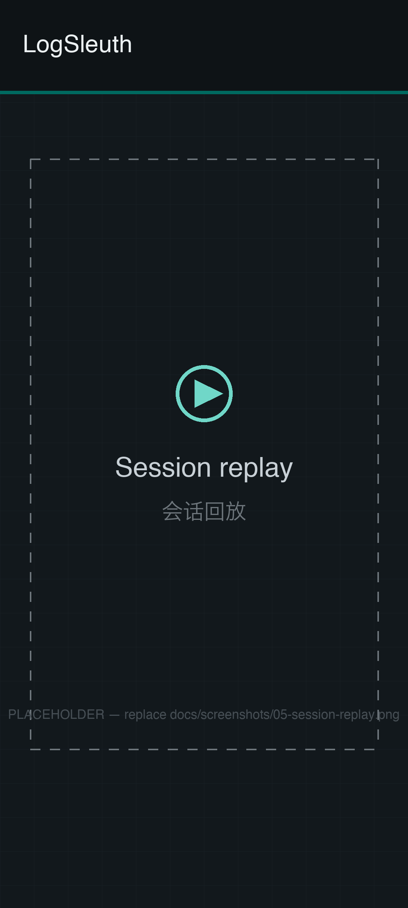
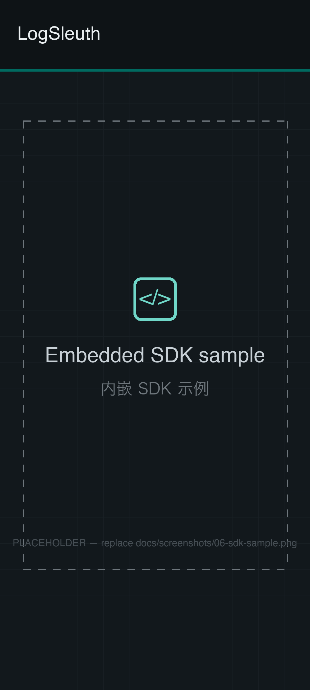

# LogSleuth

**A powerful, root-free logcat viewer & embedded logging SDK for Android.**
On a mission to be the easiest and most delightful logging tool on Android.

[简体中文](README.zh-CN.md)

[](https://github.com/shiaho777/LogSleuth/actions/workflows/ci.yml)
[](https://github.com/shiaho777/LogSleuth/releases/latest)
[](LICENSE)

## Screenshots

| Live logcat stream | Filters & Presets | Crash & ANR detection |
| :---: | :---: | :---: |
|  |  |  |
| **Recording sessions** | **Session replay** | **Embedded SDK sample** |
|  |  |  |

## What is LogSleuth?

LogSleuth is an open-source (Apache-2.0) Android logging toolkit with two modes:

### 1. Logcat Viewer (the app)

A polished, Logcat-style live log viewer for the whole device — no root required:

| Feature | Description |
| --- | --- |
| Live stream | Real-time logcat with level coloring, pause/resume, auto-scroll |
| Filters | Level / tag / keyword / regex / exclusion filters, saved filter presets |
| Per-app filter | Filter by target app (requires Shizuku) |
| Recording | Record sessions in the background, replay them later |
| Crash & ANR detection | Highlights `FATAL EXCEPTION` and ANR events, notifies you |
| Bookmarks | Optional floating bubble to timestamp "the problem happened NOW" |
| Export | Share sessions as `.txt` or `.zip` with device info attached |

### 2. Embedded SDK (`logsleuth-sdk`)

For app developers: drop the SDK into your own app and it records your app's
logs, crashes and ANRs **with zero permissions and zero network**. End users
tap "share logs" and send you a zip — you finally see what happened on their device.

```kotlin
class MyApp : Application() {
    override fun onCreate() {
        super.onCreate()
        Sleuth.init(this)
    }
}

// Anywhere in your app:
Sleuth.shareLogs(activity)   // opens the system share sheet with a zip of logs
```

LogSleuth (the viewer app) can directly open and render SDK export files.

## Why "no root" needs one of two grants

Since Android 4.1, apps cannot read other apps' logs. There is **no** way around
this without one of the following one-time grants (this is a platform rule that
applies to every logcat app):

1. **Shizuku (recommended)** — no root, no PC needed on Android 11+ via Wireless Debugging. Install [Shizuku](https://shizuku.rikka.app/), start it once, and authorize LogSleuth.
2. **ADB one-time grant** — with a PC, run once (persists until uninstall):
   ```bash
   adb shell pm grant io.github.shiaho777.logsleuth.app android.permission.READ_LOGS
   ```

The **embedded SDK mode needs nothing at all** — an app can always read its own logs.

## Project structure

```
app/      The LogSleuth viewer app (Kotlin + Jetpack Compose, Material 3)
sdk/      logsleuth-sdk — the embeddable, zero-permission logging library
sample/   Demo app showing SDK integration
```

## Architecture

```text
LogcatSource (local READ_LOGS / Shizuku shell)
  → LogcatEngine (single owner of the logcat process, auto-reconnect)
      ├→ Stream UI (level colors, filters, search, pause/buffering)
      ├→ RecordingManager (foreground service → session files + Room)
      └→ CrashDetector (FATAL EXCEPTION / ANR → events + notifications)

logsleuth-sdk (embedded in a host app — zero permissions, zero network):
  Sleuth.init → own-process logcat capture + crash handler + ANR watchdog
              → ring-buffered log files (with secret redaction)
              → one-tap zip share (opens in the viewer for replay)
```

## Build from source

Requires JDK 17+ and Android SDK platform 36.

```bash
git clone https://github.com/shiaho777/LogSleuth.git
cd LogSleuth
./gradlew assembleDebug          # app + sdk + sample
./gradlew test                   # unit tests
python3 scripts/check_string_parity.py   # bilingual string gate (runs in CI)
```

## Building

Requirements: JDK 17+, Android SDK 35.

```bash
./gradlew assembleDebug        # build the app
./gradlew :sdk:assemble        # build the SDK AAR
./gradlew test                 # unit tests
```

## Download

- GitHub Releases (see Releases page)
- F-Droid *(planned after first public release)*
- Google Play *(planned)*

## Contributing

See [CONTRIBUTING.md](CONTRIBUTING.md). Bug reports and feature requests are
welcome via GitHub Issues.

## License

[Apache-2.0](LICENSE)
