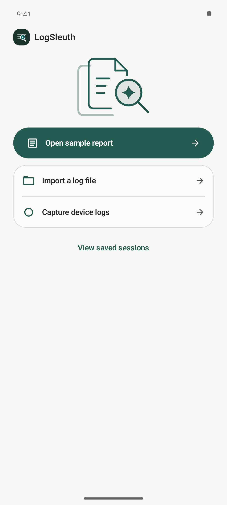
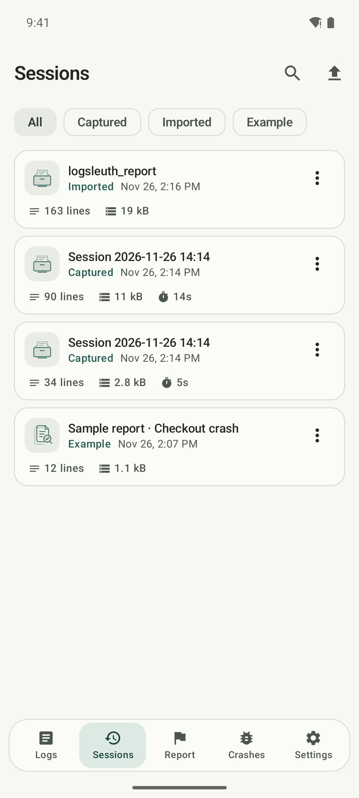
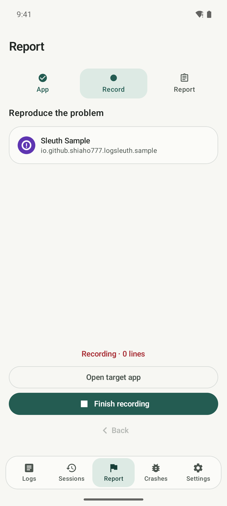
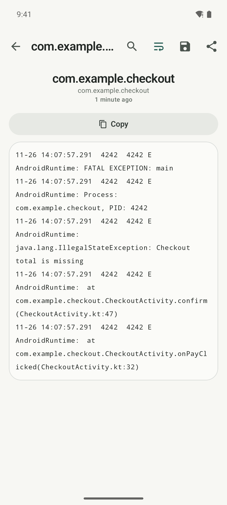
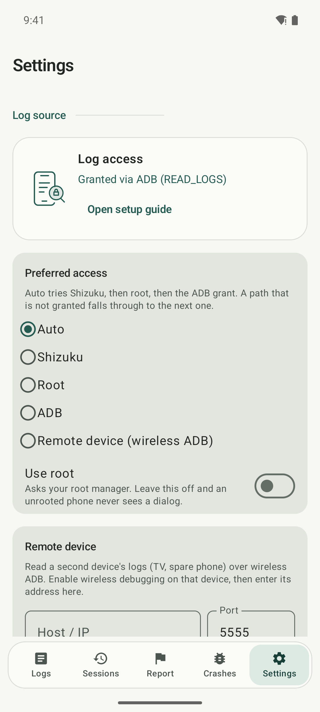
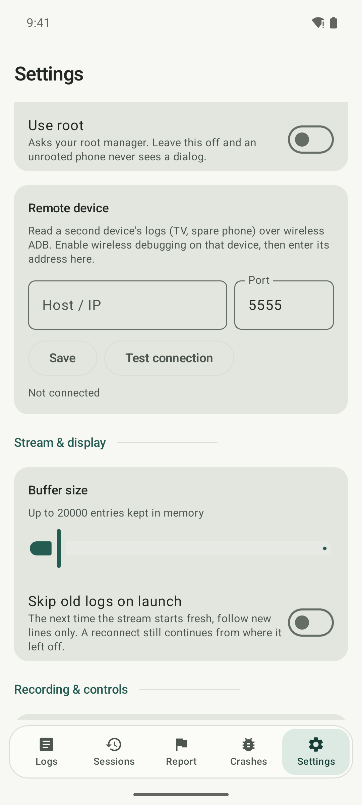

<div align="center">
  <h1>LogSleuth</h1>
  
  <p><strong>Find the Android logs around a failure, then open them again as a session.</strong></p>
  <p>Watch live Logcat, record a reproduction, or open a report someone sent you. The embedded SDK captures logs, crashes, and ANRs inside your own app.</p>
  <p>
    <a href="https://github.com/shiaho777/LogSleuth/releases/latest">Download the APK</a> ·
    <a href="#quick-start">Quick start</a> ·
    <a href="#embedding-the-sdk">Embed the SDK</a> ·
    <a href="README.zh-CN.md">简体中文</a>
  </p>
  <p>
    <a href="https://github.com/shiaho777/LogSleuth/actions/workflows/ci.yml"></a>
    <a href="LICENSE"></a>
  </p>
</div>

## Install

LogSleuth runs on **Android 8.0 (API 26) and newer**. For a regular installation, download the `LogSleuth-*.APK` asset from [GitHub Releases](https://github.com/shiaho777/LogSleuth/releases/latest).

The gallery shows the current source build. For the sample report on first launch and the interface shown below, [build from source](#build-and-contribute). The stable v0.4.2 APK uses the previous interface.

## Screenshots

<p align="center">
  <a href="docs/screenshots/16-welcome.png"></a>
  <a href="docs/screenshots/05-session-replay.png"></a>
  <a href="docs/screenshots/12-report.png"></a>
</p>

<p align="center">First launch · Session replay · Report ready. Select an image to view it at full size.</p>

<details>
<summary>First launch and log access</summary>

<p align="center">
  <a href="docs/screenshots/11-setup.png"></a>
  <a href="docs/screenshots/14-tour.png"></a>
  <a href="docs/screenshots/25-import.png"></a>
</p>

</details>

<details>
<summary>Live stream, filter, search, and select</summary>

<p align="center">
  <a href="docs/screenshots/01-live-stream.png"></a>
  <a href="docs/screenshots/02-filters.png"></a>
  <a href="docs/screenshots/07-search.png"></a>
</p>

<p align="center">
  <a href="docs/screenshots/09-selection.png"></a>
  <a href="docs/screenshots/10-scope-picker.png"></a>
</p>

</details>

<details>
<summary>Replay, inspect, and bookmark</summary>

<p align="center">
  <a href="docs/screenshots/04-sessions.png"></a>
  <a href="docs/screenshots/20-bookmarks.png"></a>
  <a href="docs/screenshots/26-entry-message.png"></a>
</p>

<p align="center">
  <a href="docs/screenshots/08-entry-detail.png"></a>
</p>

<p align="center">
  <a href="docs/screenshots/21-wide-detail.png"></a>
</p>

</details>

<details>
<summary>Reproduce, inspect crashes, and share</summary>

<p align="center">
  <a href="docs/screenshots/17-report-app.png"></a>
  <a href="docs/screenshots/18-report-recording.png"></a>
  <a href="docs/screenshots/03-crashes.png"></a>
</p>

<p align="center">
  <a href="docs/screenshots/19-crash-detail.png"></a>
  <a href="docs/screenshots/15-share-sheet.png"></a>
</p>

</details>

<details>
<summary>Settings, remote capture, automation, and SDK</summary>

<p align="center">
  <a href="docs/screenshots/13-settings.png"></a>
  <a href="docs/screenshots/23-remote-adb.png"></a>
  <a href="docs/screenshots/22-automation.png"></a>
</p>

<p align="center">
  <a href="docs/screenshots/24-dark-theme.png"></a>
  <a href="docs/screenshots/06-sdk-sample.png"></a>
</p>

</details>

[Screenshot index and capture details](docs/screenshots/README.md)

## Quick start

1. **Open a report.** In the source build, choose **Open sample report** to explore a fictional checkout crash, or **Import a log file** to open a ZIP, TXT, or LOG. On v0.4.2, skip the setup wizard and import from **Sessions**. These paths work without device log access.
2. **Read the timeline.** In **Sessions**, open a report and switch between **Logs**, **Crashes**, and **Bookmarks**. In the sample, **Tapped Pay** jumps to the nearby log line. Tap a log to switch between its message and raw line.
3. **Capture your own logs.** Choose **Capture device logs** on the source build’s start screen, or open the setup guide from **Settings**. Filter the live stream, start a recording, and use **Preview logs** before sharing TXT or ZIP. In **Report**, pick a target app to follow the guided capture flow.

### Choose a log source

| Source | When to use it |
| --- | --- |
| **Shizuku** | Recommended for an unrooted phone. Start Shizuku and grant LogSleuth access. It supports per-app filtering and background capture. |
| **ADB grant** | For local device logs with a computer. On Android 13+, keep the viewer on screen when the stream starts or reconnects so Android can show the approval prompt. |
| **Root** | For a device that already has root. Enable **Use root** explicitly in the setup guide. |
| **Remote ADB** | On the source build, read a second Android device on a trusted network using classic TCP ADB. |

Read the [log access guide](docs/guide/log-access.md) for setup and [the remote-device guide](docs/guide/remote-device.md) for the second-device flow.

## What you can do

- **Find the lines that matter.** Filter by level, tag, text, or regex. Combine including and excluding rules. Jump between search matches or use the right-edge rail to find clusters of errors in the buffer.
- **Keep the context.** Save a snapshot or record the filtered stream. Bookmark the moment from the notification or the optional floating controls, then reopen the session to read the surrounding lines.
- **Investigate crashes and freezes.** Review Java crashes, native crashes, and ANRs. Open the stack and available surrounding logs. Configure saving and notifications separately.
- **Send a report someone can open.** Preview a session, share TXT or ZIP, or import a ZIP from the embedded SDK back into the viewer. The optional [automation rules](docs/guide/automation.md) can send matching lines to an app you choose.

For more detail, see [filters and presets](docs/guide/filters.md) and [recording and crash detection](docs/guide/recording-and-crashes.md).

## Embedding the SDK

The SDK captures its host app’s logs, Java crashes, and ANRs. It declares no Android permissions, makes no network requests, and can redact configured patterns before writing logs. A user can share a ZIP from your app even if the LogSleuth viewer is absent.

The current stable Release ships the viewer APK. Start with the included [sample app](sample/) and the [SDK source module](sdk/). When both modules are in the same Gradle build, add the project dependency in your app.

```kotlin
implementation(project(":sdk"))
```

Initialize from your `Application`. If you create a new subclass, register it with `android:name=".MyApp"` on your manifest’s `<application>` element.

```kotlin
import android.app.Application
import io.github.shiaho777.logsleuth.sdk.Sleuth

class MyApp : Application() {
    override fun onCreate() {
        super.onCreate()
        Sleuth.init(this)
    }
}
```

In an Activity, call this from your support or feedback action.

```kotlin
Sleuth.shareLogs(this)
```

To test integration through a Maven artifact, publish to the checkout’s local staging repository and run the sample against it. [SDK build and publishing notes](docs/developer/release.md#sdk-smoke-build)

## Build and contribute

Use **JDK 21** to match CI and install **Android SDK platform 36**.

```bash
git clone https://github.com/shiaho777/LogSleuth.git
cd LogSleuth
python3 scripts/check_string_parity.py
./gradlew assembleDebug test lint
```

The viewer APK is written to `app/build/outputs/apk/debug/app-debug.apk`. The SDK sample APK is under `sample/build/outputs/apk/debug/`. See the [contribution guide](CONTRIBUTING.md) for changes to the viewer, SDK, tests, or translations, and the [developer guide](docs/developer/index.md) for architecture.

## Help and privacy

- **Missing logs or app names?** Check the active source in **Settings**. The [log access guide](docs/guide/log-access.md) explains the grant, restart behavior, and which sources can associate logs with apps.
- **Reporting a bug?** Include the LogSleuth version, Android version, log source, and steps to reproduce. Remove private information from any logs or screenshots you attach. [Open a bug report](https://github.com/shiaho777/LogSleuth/issues/new?template=bug_report.yml)
- **Where does the data go?** Captured files stay on the device. Export and automation send data when you use those features. The viewer uses the network for updates and for a remote source you configure.
- **More help.** [User guide](https://shiaho777.github.io/LogSleuth/guide/) · [Issues](https://github.com/shiaho777/LogSleuth/issues) · [QQ 1127256026](https://qm.qq.com/q/Gzj7CpirAs) · [Bilibili](https://space.bilibili.com/2127032909)

## License

[Apache License 2.0](LICENSE). The README uses the project’s app icon and captures of the LogSleuth viewer and SDK sample.
