# LogSleuth

**强大、免 Root 的安卓日志查看器 + 内嵌日志 SDK。**
目标是做安卓上操作最方便、体验最好的日志工具。

[English](README.md)

[](https://github.com/shiaho777/LogSleuth/actions/workflows/ci.yml)
[](https://github.com/shiaho777/LogSleuth/releases/latest)
[](LICENSE)

## 截图

| 实时日志流 | 搜索与命中跳转 | 过滤与预设 |
| :---: | :---: | :---: |
| <a href="docs/screenshots/01-live-stream.png">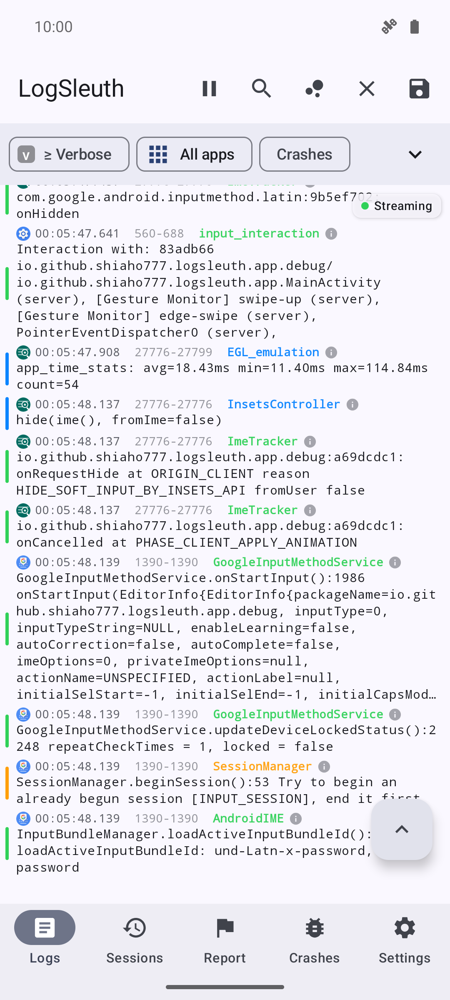</a> | <a href="docs/screenshots/07-search.png">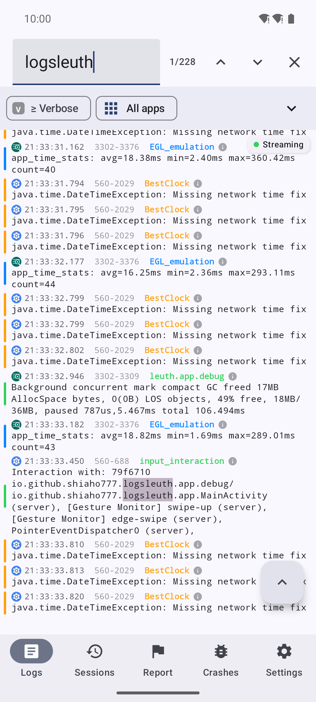</a> | <a href="docs/screenshots/02-filters.png">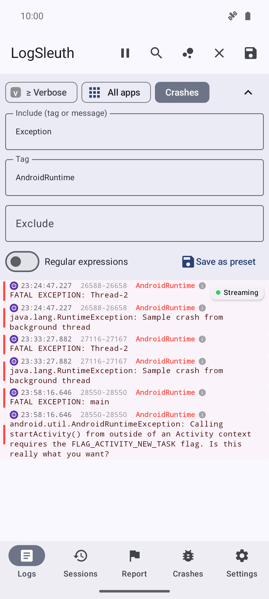</a> |
| **崩溃 / ANR 侦测** | **日志详情** | **多选与复制** |
| <a href="docs/screenshots/03-crashes.png">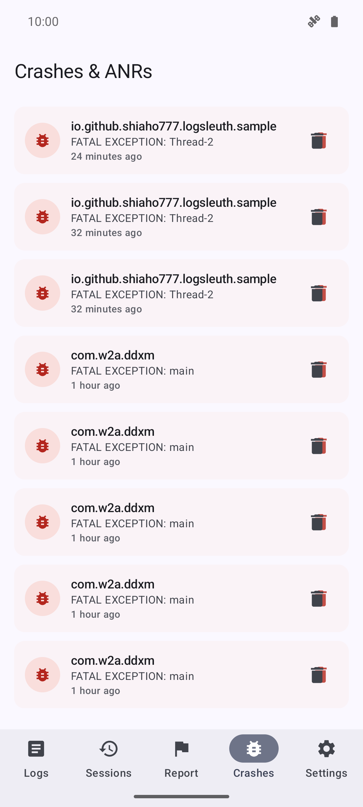</a> | <a href="docs/screenshots/08-entry-detail.png">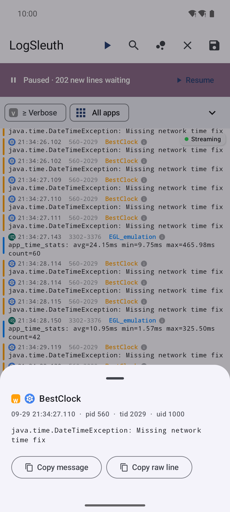</a> | <a href="docs/screenshots/09-selection.png">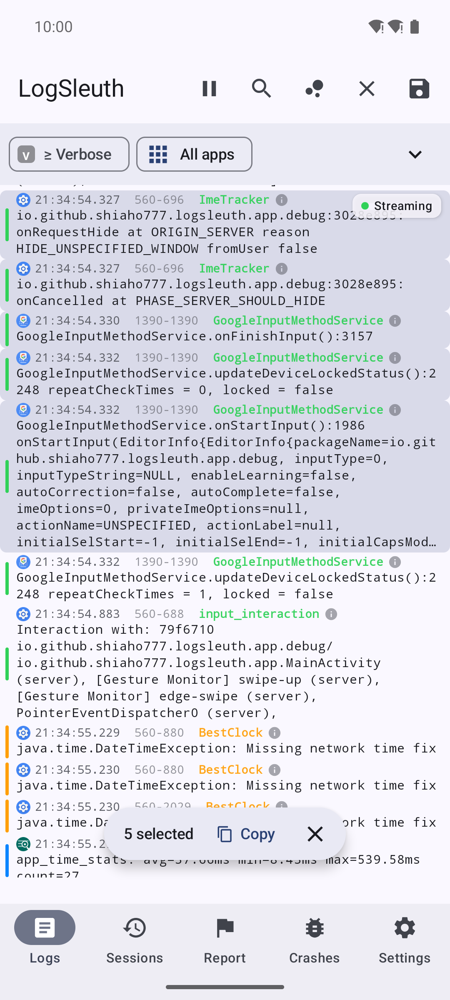</a> |
| **按应用范围选择** | **录制会话** | **会话回放** |
| <a href="docs/screenshots/10-scope-picker.png">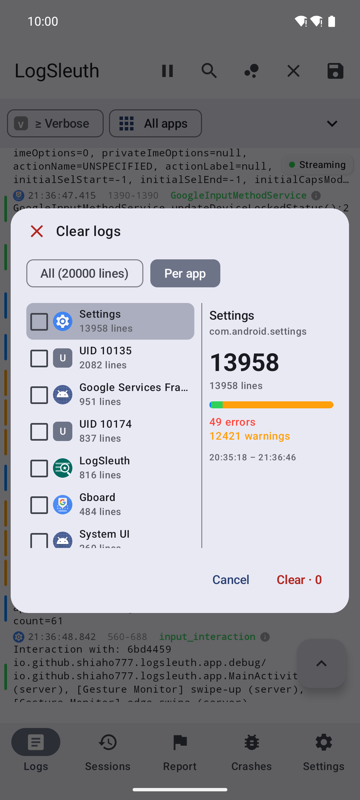</a> | <a href="docs/screenshots/04-sessions.png">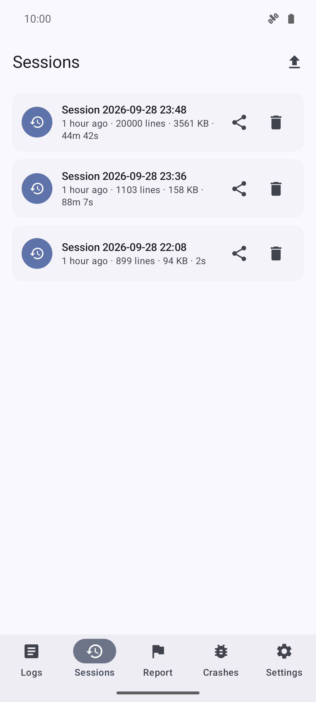</a> | <a href="docs/screenshots/05-session-replay.png">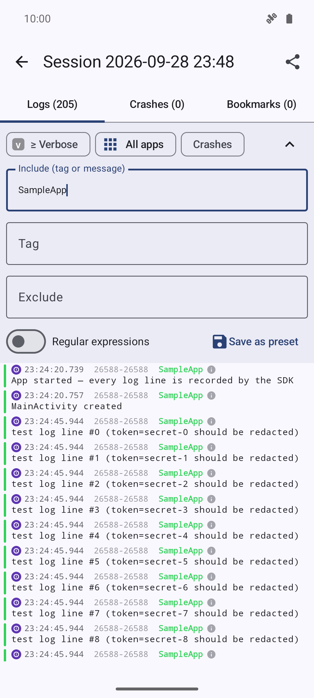</a> |
| **报告向导与导出** | **保存与分享** | **权限向导** |
| <a href="docs/screenshots/12-report.png">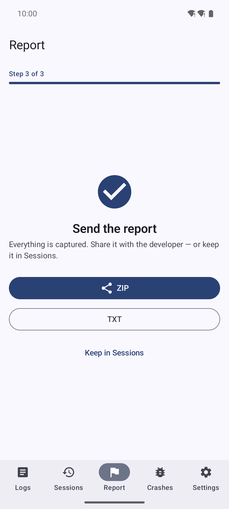</a> | <a href="docs/screenshots/15-share-sheet.png">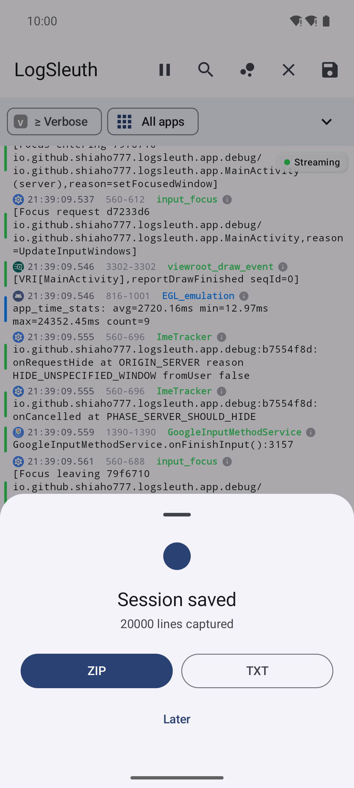</a> | <a href="docs/screenshots/11-setup.png">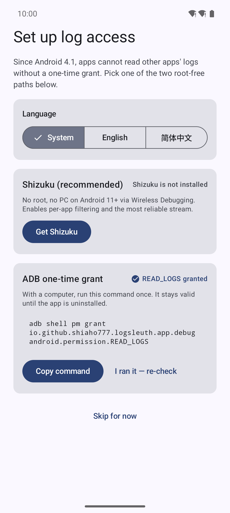</a> |
| **设置与应用内更新** | **使用引导** | **内嵌 SDK 示例** |
| <a href="docs/screenshots/13-settings.png">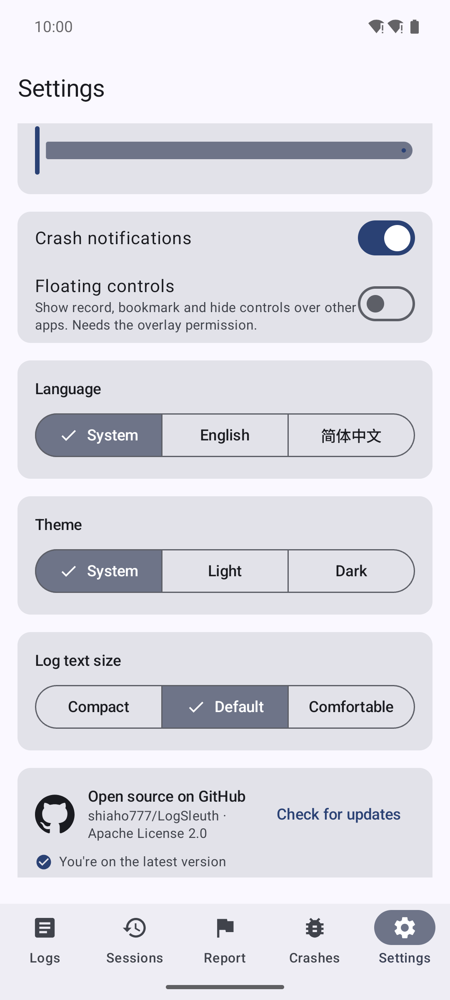</a> | <a href="docs/screenshots/14-tour.png">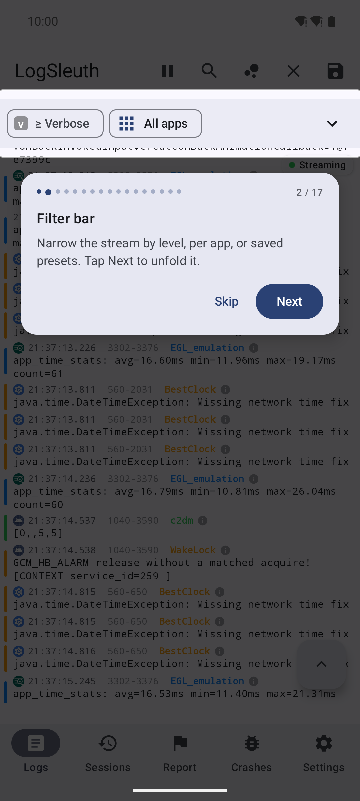</a> | <a href="docs/screenshots/06-sdk-sample.png">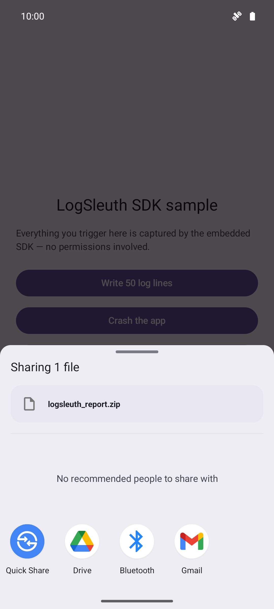</a> |

## LogSleuth 是什么?

LogSleuth 是一个开源(Apache-2.0)的安卓日志工具箱,两半配合工作:

- **查看器 App**——面向全设备的 Logcat 风格实时日志查看器,Kotlin +
  Jetpack Compose(Material 3)编写。免 Root:经 Shizuku 或 ADB 一次性授权
  即可解锁全部功能。
- **`logsleuth-sdk`**——嵌入你自己 App 的日志库,**零权限、零网络**地
  记录本应用的日志、崩溃与 ANR,打包成 zip 让用户一键发给你。查看器
  App 可以直接打开这些 zip 回放。

## 功能总览

### 看流

| 功能 | 说明 |
| --- | --- |
| 实时 logcat | threadtime 行:级别着色、pid·tid·uid 列、每行显示所属应用图标 |
| 丝滑追底 | 传送带式自动滚动,速度跟随到达速率;上滑脱钉,回滑到底自动复钉 |
| 暂停缓冲 | 冻结显示但后台继续攒行——横幅实时统计攒了多少条 |
| 搜索 | 全缓冲区检索:命中计数、匹配高亮、上/下一条跳转 |
| 跳转按钮 | FAB 一键跳到缓冲最早一条,或回到实时尾部 |
| 引擎状态徽标 | Streaming / Connecting / Stopped / Error 一眼可知;失败时显示真实原因(如 `logcat exited 1`);指数退避自动重连 |

### 收窄范围

| 功能 | 说明 |
| --- | --- |
| 过滤器 | 级别阈值(V–A)、Tag、关键字、排除模式、正则开关——可组合 |
| 过滤预设 | 一组条件存成预设随取随用,预设拥有独立管理页 |
| 按应用过滤 | 流上方芯片,只看某个 App 的日志(包名解析需 Shizuku) |
| 应用选择器 | 已安装应用列表,带图标与各应用行数统计 |

### 就地操作

| 功能 | 说明 |
| --- | --- |
| 日志详情 | 点按行尾 ℹ 看完整消息、pid/tid/uid,可复制消息或原始行 |
| 多选 | 长按进入选择,再点扩展范围,整块复制 |
| 按范围清理/保存 | 擦除或快照**全部**,也可在双栏选择器里勾选指定应用(带各应用行数/错误/告警统计) |
| 会话快照 | 一键把当前缓冲区存成会话 |

### 录制与回放

| 功能 | 说明 |
| --- | --- |
| 后台录制 | 前台服务,通知里实时显示已捕获行数(附"停止/书签"按钮) |
| 快捷开关瓷贴 | "录制日志"磁贴,录制中实时显示行数 |
| 悬浮气泡 | 可选悬浮控件:在其他应用上就能录制/打书签/收起(需悬浮窗权限) |
| 时间戳书签 | 录制中标记"问题就是这一刻"——回放时会话的书签页可见 |
| 自动停止上限 | 体积上限(8–512 MB,默认 64)与时长上限(0–24 小时,默认不限) |
| 前段回填 | 录制可包含你按下录制键之前已缓冲的行 |
| 会话回放 | 重开任意会话——日志/崩溃/书签三页签,与实时流同一套过滤和搜索 |
| 会话管理 | 滑动删除 + 可撤销;每个会话都可再次分享 |

### 崩溃与 ANR

| 功能 | 说明 |
| --- | --- |
| 实时侦测 | 流式或录制期间自动标记 `FATAL EXCEPTION`、原生 `Fatal signal` 与 ANR |
| 事件列表 | 崩溃卡片可展开完整堆栈;可分享、可删除(可撤销) |
| 通知 | 崩溃落地时可选弹通知(设置里可关) |

### 报告、导出与导入

| 功能 | 说明 |
| --- | --- |
| 报告向导 | 三步:选出问题的 App → 复现期间后台录制 → 分享 ZIP/TXT 或保留到会话;窗口期内的崩溃自动标记附带 |
| 导出 | 会话与报告可导出 `.txt` 或 `.zip`(zip 附带设备信息) |
| 导入 | 从文件管理器或分享面板打开 `.zip`/`.txt`/`.log`——LogSleuth 直接渲染成会话(SDK 导出包也走这条路) |

### 体验细节

| 功能 | 说明 |
| --- | --- |
| 使用引导 | 17 步手把手引导,直接驱动真实 UI;随时可从 设置 → 关于 重播 |
| 权限向导 | Shizuku 状态卡 + 可复制的 ADB 授权命令,就地复检 |
| 双语 | English / 简体中文,应用内语言可覆盖系统 |
| 主题与字号 | 跟随系统 / 浅色 / 深色;日志字号紧凑 / 默认 / 舒适 |
| 应用内更新 | GitHub Releases 检查、发行说明、APK 断点续传(暂停/继续/取消)、一键安装、版本历史 |
| 缓冲区可调 | 内存环形缓冲 1,000–200,000 行(默认 20,000) |

### 内嵌 SDK(`logsleuth-sdk`)

给 App 开发者——上面那一套能力,但只对着*你自己的*进程:

| 能力 | 说明 |
| --- | --- |
| 零门槛 | 不声明任何权限、无网络、无账号——App 本来就能读自己的日志 |
| 采集 | 自进程 logcat 线程 + Java 崩溃接管(链式回传给原处理器)+ 主线程 ANR 看门狗 |
| 存储 | 环形日志文件(默认 3 个 × 各 ≤2 MB),自动轮转 |
| 隐私 | `addRedaction(Regex)` 落盘前脱敏密钥 |
| 回调 | `Sleuth.onCrash { … }`——默认下次启动时回调,也可改为崩溃当场 |
| 分享 | `Sleuth.shareLogs(activity)` 打包日志 + 设备信息 + 元数据,弹系统分享面板 |

## 上手

### 1. 安装

从 [Releases](https://github.com/shiaho777/LogSleuth/releases) 下载 APK 安装
(Android 8.0+ / API 26,约 2.4 MB)。

### 2. 授予日志权限

从 Android 4.1 起,应用无法读取其他 App 的日志——这是平台限制,对所有
日志类 App 一视同仁。二选一,一次性授权:

1. **Shizuku(推荐)**——无需 Root,Android 11+ 可经"无线调试"在手机上
   直接激活,无需电脑。安装 [Shizuku](https://shizuku.rikka.app/),启动
   一次,授权 LogSleuth 即可;顺带解锁按应用过滤。
2. **ADB 一次性授权**——有电脑的话执行一次即可(卸载前一直有效):
   ```bash
   adb shell pm grant io.github.shiaho777.logsleuth.app android.permission.READ_LOGS
   ```

首次启动的权限向导会带你走完任一路径;之后随时可从 设置 → 日志权限 →
"打开设置向导"重进。

### 3. 跟着引导走一遍

首启会有 17 步手把手引导,直接驱动真实 UI——替你展开过滤栏、暂停流、
输入搜索词、弹出范围选择器。可跳过,也可随时从 设置 → 关于 → "重播使用
引导"再看一遍。

## 日常用法

- **"用户反馈某 App 老崩溃"** → 报告页 → 选中该应用 → 开始录制 → 把手机
  交给对方 → 停止并分享。窗口期内的崩溃自动标记附带。
- **"日志太吵"** → 展开过滤栏,级别拉到 ≥ Warn 加 Tag/关键字——或按
  应用过滤(Shizuku)。常用组合可存成预设。
- **"我要标记出事那一刻"** → 开启悬浮控件(需悬浮窗权限)或用快捷开关
  瓷贴:不用离开被测应用就能录制 + 打书签。
- **"收到一份日志 zip / txt"** → 直接用 LogSleuth 打开,或在会话页点
  导入——进来就是可回放的会话。
- **"这一行很关键"** → 点行尾 ℹ 看完整消息并可复制;长按多选可复制
  一整块。

## 集成 SDK

把模块加进你的项目(目前为源码模块;Maven 构件计划随公开版本发布):

```kotlin
// app/build.gradle.kts
implementation(project(":sdk"))
```

```kotlin
class MyApp : Application() {
    override fun onCreate() {
        super.onCreate()
        Sleuth.init(this)   // 即刻开始采集——无需任何权限
    }
}

// App 内任意位置——比如"发送日志"客服按钮:
Sleuth.shareLogs(activity)   // 弹系统分享面板,打包好的日志 zip
```

通过 `SleuthConfig.Builder` 配置:

| 选项 | 默认值 | 含义 |
| --- | --- | --- |
| `tagFilter(String)` | `null`(全部) | 只记录 Tag 含该串的行(外加所有 ERROR 行) |
| `maxFiles(Int)` | 3 | 环形缓冲文件数,1–20 |
| `maxFileBytes(Long)` | 2 MB | 单文件超过即轮转(最小 64 KB) |
| `captureLogcat(Boolean)` | `true` | 设为 false 则只记崩溃/ANR |
| `watchAnr(Boolean)` | `true` | 主线程心跳 ANR 看门狗 |
| `onCrashInvokedOnNextStart(Boolean)` | `true` | 崩溃回调放在下次 init 投递,而非崩溃当场 |
| `addRedaction(Regex)` | — | 额外脱敏模式,写盘前剥离 |

完整 API:

```kotlin
Sleuth.init(context, SleuthConfig.Builder().tagFilter("net").build())
Sleuth.onCrash { report -> /* 默认下次启动时投递——入队即可 */ }
Sleuth.log("Checkout", "order=42 placed")       // 注入自定义日志行
Sleuth.logException("Checkout", throwable)
val files: List<File> = Sleuth.logFiles()       // 底层环形缓冲文件
Sleuth.shareLogs(activity)
```

zip 包含 `device.txt`(厂商/机型/Android 版本)、`meta.txt` 和日志文件;
查看器 App 原生打开它,所以客服流程就是"把 zip 发我"→ 点开即可回放。

## 架构

```text
LogcatSource(本机 READ_LOGS / Shizuku shell)
  → LogcatEngine(唯一的 logcat 进程持有者,断线自动重连)
      ├→ 实时日志流 UI(级别着色、过滤、搜索、暂停缓冲)
      ├→ RecordingManager(前台服务 → 会话文件 + Room)
      └→ CrashDetector(FATAL EXCEPTION / Fatal signal / ANR → 事件 + 通知)

logsleuth-sdk(内嵌在宿主 App——零权限、零网络):
  Sleuth.init → 自进程日志捕获 + 崩溃接管 + ANR 看门狗
              → 环形日志文件(带密钥脱敏)
              → 一键 zip 分享(查看器可直接打开回放)
```

## 权限说明

App 声明的每个权限及用途:

| 权限 | 用途 |
| --- | --- |
| `READ_LOGS` | 读取设备日志(经 Shizuku 或 ADB 命令授予——本应用的核心) |
| `moe.shizuku…API_V23` | 与 Shizuku 服务通信 |
| `FOREGROUND_SERVICE` + `…_DATA_SYNC` | 保持后台录制存活 |
| `POST_NOTIFICATIONS` | 录制状态、崩溃/ANR 提醒、自动停止通知 |
| `SYSTEM_ALERT_WINDOW` | 悬浮录制/书签气泡——仅在你开启时生效 |
| `INTERNET` | 仅用于 GitHub Releases 更新检查——无统计、无广告 |
| `REQUEST_INSTALL_PACKAGES` | 安装下载好的 APK 更新 |

**SDK 自身不声明任何权限**——它只读宿主 App 自己的日志。

## 项目结构

```
app/      LogSleuth 查看器 App(Kotlin + Jetpack Compose, Material 3)
sdk/      logsleuth-sdk —— 可内嵌的零权限日志库
sample/   演示 SDK 集成的示例 App
```

## 从源码构建

需要 JDK 17+ 和 Android SDK platform 36。

```bash
git clone https://github.com/shiaho777/LogSleuth.git
cd LogSleuth
./gradlew assembleDebug          # app + sdk + sample
./gradlew test                   # 单元测试
python3 scripts/check_string_parity.py   # 双语字符串门禁(CI 会跑)
```

## 下载

- GitHub Releases(见 Releases 页面)
- F-Droid(首个公开版本发布后上架)
- Google Play(计划中)

## 参与贡献

见 [CONTRIBUTING.md](CONTRIBUTING.md)。欢迎通过 GitHub Issues 提交
Bug 报告和功能建议。

## 许可证

[Apache-2.0](LICENSE)
